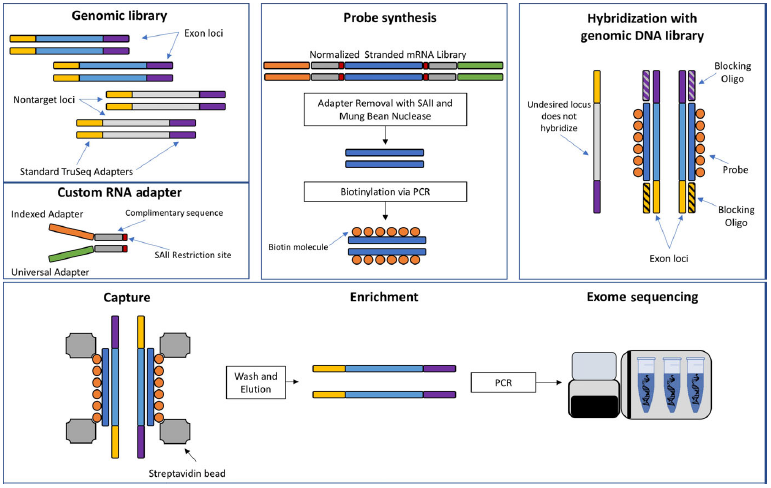
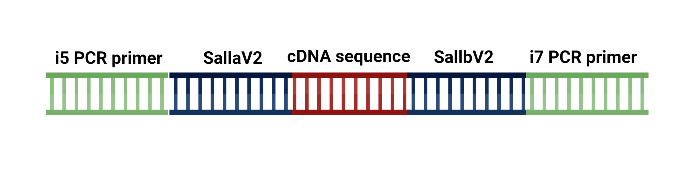
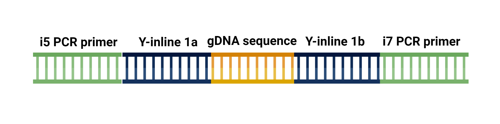

# EecSeq Library Synthesis Oligos Breakdown: understanding the ins and outs of how  custom adapters and primers work

- [EecSeq Library Synthesis Oligos Breakdown: understanding the ins and outs of how  custom adapters and primers work](#eecseq-library-synthesis-oligos-breakdown-understanding-the-ins-and-outs-of-how--custom-adapters-and-primers-work)
  - [EecSeq protocol overview](#eecseq-protocol-overview)
  - [mRNA adapter annealing preparation](#mrna-adapter-annealing-preparation)
    - [Y-inline mRNA adapters](#y-inline-mrna-adapters)
  - [mRNA adapter orientation post ligation](#mrna-adapter-orientation-post-ligation)
  - [mRNA PCR amplification with indexed primers](#mrna-pcr-amplification-with-indexed-primers)
    - [PCR primers for EecSeq](#pcr-primers-for-eecseq)
      - [i5 PCR Primers](#i5-pcr-primers)
      - [i7 PCR primers](#i7-pcr-primers)
  - [Adapter removal from DSN treated cDNA libraries for probe synthesis](#adapter-removal-from-dsn-treated-cdna-libraries-for-probe-synthesis)
  - [gDNA adapter annealing](#gdna-adapter-annealing)
    - [Y-inline a adapters](#y-inline-a-adapters)
    - [Y-inline b adapters](#y-inline-b-adapters)
  - [gDNA adapter ligation orientation post ligation](#gdna-adapter-ligation-orientation-post-ligation)
  - [gDNA PCR amplification with indexed primers](#gdna-pcr-amplification-with-indexed-primers)

## EecSeq protocol overview



## mRNA adapter annealing preparation

For the EecSeq protocol we use a custom pair of adapters. These SaII adapters are manufactured individually, an SaIIa and a SaIIb, and must be annealed together. One of the intial steps in the EecSeq protocol is to anneal these adpaters in the proper concentrations and for an indepth protocol on how to anneal these adapters see this [write up](https://github.com/MarineEvoEcoLab/Lab_Resources/blob/master/Protocols/Lyophilized%20Oligonucleotides.md). For this write up we are focusing on why and how these oligonucleotides are aligning. The full adapter set available for this EecSeq protocol is listed here:

### Y-inline mRNA adapters

- Y-inline-SaIIa_v2
    > CACTCTTTCCCTACACGACGCTCTTCCGATCTNNNNNNNGTCGAC*T
- Y-inline-SaIIb_v2
    > /5Phos/G*TCGACNNNNNNNAGATCGGAAGAGCACACGTCTGAACTCCAGTC
- Y-inline-SaIIa_NO_N
    > CACTCTTTCCCTACACGACGCTCTTCCGATCTGTCGAC*T
- Y-inline-SaIIb_NO_N
    > /5Phos/G*TCGACAGATCGGAAGAGCACACGTCTGAACTCCAGTC
- Y-inline-NcoIa_v2
    > CACTCTTTCCCTACACGACGCTCTTCCGATCTCCATGG*T
- Y-inline-NcoIb_v2
    > /5Phos/C*CATGGAGATCGGAAGAGCACACGTCTGAACTCCAGTC

For this example we will be using SallaV2 and SallbV2

Labeling directionality for the alignment of this adapter set:

* Y-inline-SaIIb_v2:
    > 5' /5Phos/*G(cut site)TCGACNNNNNNNAGATCGGAAGAGCACACGTCTGAACTCCAGTC 3'

* Y-inline-SaIIa_v2:
    >3' T*CAGCT(cut site)GNNNNNNNTCTAGCCTTCTCGCAGCACATCCCTTTCTCAC 5'

In these sequences the "N's" are any nucleotide and we have 7 of them inside of this custom adapter. This "N" section as a unique sequence that can readily identify unique libraries. The cut site that is specific for the SAII restriction enzyme is labeled. The specific nucleotide sequence is G/TCGAC with the slash being the cut site for the enzyme.

So how might these two oligonucleotides align?

```text
5' /Phos/*GTGACNNNNNNNAGATCGGAAGAGCACACGTCTGAACTCCAGTC 3'
            |||       |||||||||||||        |      |||    
    3' T*CAGCTGNNNNNNNTCTAGCCTTCTCGCAGCACATCCCTTTCTCAC 5'
```

 We can see that there are regions where the two adapters are complimentary and other areas where they are not. The primary annealing region in located in the middle with about 13 nucleotides aligning with each other. This is why it is important to add equimolar stock of each adapter in the right chemical environment that can promote annealing. There is also a 5' phosphate group on the SallbV2 adapter which is necessary for ligation of the adapter to our RNA molecules of interest. The SallaV2 adapter has a phosphorothiate bond between the C and T (noted by the *) and is very strong. This region is important as exonuclease can remove the T during ligation of this adapter to the 3' poly-A overhang created during mRNA synthesis.

## mRNA adapter orientation post ligation

It is good to visualize how this adapter pair is oriented around a cDNA fragment. We will represent our cDNA fragment with (NNN_NNN)

*SallaV2 is on the left and SallbV2 is on the right side of the cDNA fragment*

```text
5' CACTCTTTCCCTACACGACGCTCTTCCGATCTNNNNNNNGTCGACT(NNN_NNN)GTCGACNNNNNNNAGATCGGAAGAGCACACGTCTGAACTCCAGTC 3'
```

The pool of cDNA is a double stranded molecule and will therefore have the sequence hydrogen bonded as well as the hydrogen bonds from the adapters.

*Similar orientation from before but added the complimentary strand*

```text
5' CACTCTTTCCCTACACGACGCTCTTCCGATCTNNNNNNNGTCGACT(NNN_NNN)*GTCGACNNNNNNNAGATCGGAAGAGCACACGTCTGAACTCCAGTC 3'
    |||      |        |||||||||||||       ||||||  |||||||  ||||||       |||||||||||||        |      |||
3' CTGACCTCAAGTCTGCACACGAGAAGGCTAGANNNNNNNCAGCTG*(NNN_NNN)TCAGCTGNNNNNNNTCTAGCCTTCTCGCAGCACATCCCTTTCTCAC 5'
```

## mRNA PCR amplification with indexed primers

Once the mRNA fragments have been synthesized into cDNA and our adapters have been ligated, we used custom PCR primers to amplify the cDNA libraries. Here is the full primer set

### PCR primers for EecSeq

#### i5 PCR Primers

- i5_PCRprimer_L1_D501
    > AATGATACGGCGACCACCGAGATCTACACTATAGCCTACACTCTTTCCCTACACGACGCTCTTCCGATC*T
- i5_PCRprimer_L2_D502_GCCTCTAT
    > AATGATACGGCGACCACCGAGATCTACACATAGAGGCACACTCTTTCCCTACACGACGCTCTTCCGATC*T
- i5_PCRprimer_L3_D503_AGGATAGG
    > AATGATACGGCGACCACCGAGATCTACACCCTATCCTACACTCTTTCCCTACACGACGCTCTTCCGATC*T
- i5_PCRprimer_L4_D504_TCAGAGCC
    > AATGATACGGCGACCACCGAGATCTACACGGCTCTGAACACTCTTTCCCTACACGACGCTCTTCCGATC*T
- i5_PCRprimer_L5_D505_CTTCGCCT
    > AATGATACGGCGACCACCGAGATCTACACAGGCGAAGACACTCTTTCCCTACACGACGCTCTTCCGATC*T
- i5_PCRprimer_L6_D506_TAAGATTA
    > AATGATACGGCGACCACCGAGATCTACACTAATCTTAACACTCTTTCCCTACACGACGCTCTTCCGATC*T
- i5_PCRprimer_L7_D507_ACGTCCTG
    > AATGATACGGCGACCACCGAGATCTACACCAGGACGTACACTCTTTCCCTACACGACGCTCTTCCGATC*T
- i5_PCRprimer_L8_D508_GTCAGTAC
    > ATGATACGGCGACCACCGAGATCTACACGTACTGACACACTCTTTCCCTACACGACGCTCTTCCGATC*T
- i5_PCRprimer_L9_TTGTCGGT
    > AATGATACGGCGACCACCGAGATCTACACACCGACAAACACTCTTTCCCTACACGACGCTCTTCCGATC*T
- i5_PCRprimer_L10_TTGCCACT
    > AATGATACGGCGACCACCGAGATCTACACAGTGGCAAACACTCTTTCCCTACACGACGCTCTTCCGATC*T
- i5_PCRprimer_L11_AGTCTGTG
    > AATGATACGGCGACCACCGAGATCTACACCACAGACTACACTCTTTCCCTACACGACGCTCTTCCGATC*T
- i5_PCRprimer_L12_AAGTGTCG
    > ATGATACGGCGACCACCGAGATCTACACCGACACTTACACTCTTTCCCTACACGACGCTCTTCCGATC*T

#### i7 PCR primers

- i7_PCRprimer_701
    > CAAGCAGAAGACGGCATACGAGATCGAGTAATGTGACTGGAGTTCAGACGTGTGC*T
- i7_PCRprimer_702
    > CAAGCAGAAGACGGCATACGAGATTCTCCGGAGTGACTGGAGTTCAGACGTGTGC*T
- i7_PCRprimer_703
    > CAAGCAGAAGACGGCATACGAGATAATGAGCGGTGACTGGAGTTCAGACGTGTGC*T
- i7_PCRprimer_704
    > CAAGCAGAAGACGGCATACGAGATGGAATCTCGTGACTGGAGTTCAGACGTGTGC*T
- i7_PCRprimer_705
    > CAAGCAGAAGACGGCATACGAGATTTCTGAATGTGACTGGAGTTCAGACGTGTGC*T
- i7_PCRprimer_706
    > CAAGCAGAAGACGGCATACGAGATACGAATTCGTGACTGGAGTTCAGACGTGTGC*T
- i7_PCRprimer_707
    > CAAGCAGAAGACGGCATACGAGATAGCTTCAGGTGACTGGAGTTCAGACGTGTGC*T
- i7_PCRprimer_708
    > CAAGCAGAAGACGGCATACGAGATGCGCATTAGTGACTGGAGTTCAGACGTGTGC*T
- i7_PCRprimer_709
    > CAAGCAGAAGACGGCATACGAGATCATAGCCGGTGACTGGAGTTCAGACGTGTGC*T
- i7_PCRprimer_710
    > CAAGCAGAAGACGGCATACGAGATTTCGCGGAGTGACTGGAGTTCAGACGTGTGC*T
- i7_PCRprimer_711
    > CAAGCAGAAGACGGCATACGAGATGCGCGAGAGTGACTGGAGTTCAGACGTGTGC*T
- i7_PCRprimer_712
    > CAAGCAGAAGACGGCATACGAGATCTATCGCTGTGACTGGAGTTCAGACGTGTGC*T

I will be showing an example of just one primer set and how it aligns with our custom mRNA adapters.

- i5_PCRprimer_L1_D501
  > 5' AATGATACGGCGACCACCGAGATCTACACTATAGCCTACACTCTTTCCCTACACGACGCTCTTCCGATC*T 3'

- i7_PCRprimer_701
    > 5' CAAGCAGAAGACGGCATACGAGATCGAGTAATGTGACTGGAGTTCAGACGTGTGC*T 3'

The i5 primer can be read from the 3' end as the first 31 base pairs of the Salla adapter.

- i5 primer
    > 3' T***CTAGCCTTCTCGCAGCACATCCCTTTCTCAC**ATCCGATATCACATCTAGAGCCACCAGCGGCATAGTAA 5'

- SallaV2
    > 3' T*CAGCTGNNNNNNNT**CTAGCCTTCTCGCAGCACATCCCTTTCTCAC** 5'

This means it will bind to the compliment of the SallaV2 adapter, specifically that 31 nucleotide region.

The i7 primer can be read from the 3' end as the reverse compliment of the SallbV2 adapter. This one is a bit trickier to visualize so I will do my best to break it down here.

- i7 primer
    > 5' CAAGCAGAAGACGGCATACGAGATCGAGTAATGT**GACTGGAGTTCAGACGTGTG**CT 3'

- SallbV2
   > 5' GTCGACNNNNNNNAGATCGGAAGAGCACACGTCTGAACTCCAGTC 3'

  - Reverse the strand
    > 3' CTGACCTCAAGTCTGCACACGAGAAGGCTAGANNNNNNNCAGCTG 5'
  - Make the compliment
    > 3' **GACTGGAGTTCAGACGTGTG**CTCTTCCGATCTNNNNNNNGTCGAC 5'

In this instance only the bolded nucleotides in the reverse compliment are shared with the i7 primer. The i7 primer will bind in the first round of PCR as this is the only complimentary region of binding open to both primers. The i5 compliment will be synthesized as a consequence of the i7 primer binding to the SallbV2 adapter. Ultimately, this allows the PCR primers i5 and i7 to bind to both sense and antisense strands that are created during cDNA synthesis. How this actually works is slightly complicated to write out so we will visualize it.  

We will focus on SallbV2 adapter which is on the right of the cDNA fragment. The i7 primer binds to the SallbV2 adapter at the 3' end for the first PCR cycle. When the i7 primer binds its orientation allows for the DNA polymerase to synthesize a portion of the adapter including the important complimentary cut site, the cDNA fragment sequence of interest, and the compliment of the SallaV2 adapter.

*Binding of i7 primer to SallbV2 adapter*

```text
         <----------------- Direction of synthesis               
                                 3'CTGTGTGCAGACTTGAGGTCAGTGTAATGAGCTAGAGCATACGGCAGAAGACGAAC 5'
                                     ||||||||||||||||||||
5' (NNN_NNN)GTCGACNNNNNNNAGATCGGAAGAGCACACGTCTGAACTCCAGTC 3'                                                                                                           
```

*Result of DNA polymerase synthesis from first cycle of PCR*

```text
3' GTGAGAAAGGGATGTGCTGCGAGAAGGCTAGTNNNNNNNCAGCTGA(NNN_NNN)CAGCTGNNNNNNNTCTAGCCTTCCTGTGTGCAGACTTGAGGTCAGTGTAATGAGCTAGAGCATACGGCAGAAGACGAAC 5'
   ||||||||||||||||||||||||||||||||||||||||||||||||||||||||||||||||||||||||||||||  ||||||||||||||||||||
5' CACTCTTTCCCTACACGACGCTCTTCCGATCTNNNNNNNGTCGACT(NNN_NNN)GTCGACNNNNNNNAGATCGGAAGAGCACACGTCTGAACTCCAGTC 3'
```

During the second round of PCR the i5 primer comes into play. Since the i5 primer is exactly the first 31 base pairs of the SallaV2 primer it will bind to what we see at the "top strand", which is the compliment of the SallaV2 adapter, while the i7 primer will bind again to the "bottom" strand. Without the i5 primer we would be unable to amplify the strand containing the i7 primer because it binds to that newly synthesized compliment of SallaV2. Keep in mind that I will not be showing the free i7 primers acting on the free SallbV2 adapter regions.

*Binding of i5 primer to SallaV2 compliment region onthe top strand*

```text
3'                                          GTGAGAAAGGGATGTGCTGCGAGAAGGCTAGTNNNNNNNCAGCTGA(NNN_NNN)(SallbV2 compliment and i7 primer)
                                            |||||||||||||||||||||||||||||||
5' 5' AATGATACGGCGACCACCGAGATCTACACTATAGCCTACACTCTTTCCCTACACGACGCTCTTCCGATC*T 3'
```

*Result of DNA polymerase synthesis from second cycle of PCR*

```text
3'                                       GTGAGAAAGGGATGTGCTGCGAGAAGGCTAGTNNNNNNNCAGCTGA(NNN_NNN)CAGCTGNNNNNNNTCTAGCCTTCCTGTGTGCAGACTTGAGGTCAGTGTAATGAGCTAGAGCATACGGCAGAAGACGAAC 5'
                                         ||||||||||||||||||||||||||||||||||||||||||||||||||||||||||||||||||||||||||||||||||||||||||||||||||||||||||||||||||||||||||||||||||||||
5' AATGATACGGCGACCACCGAGATCTACACTATAGCCTACACTCTTTCCCTACACGACGCTCTTCCGATCTNNNNNNNGTCGACT(NNN_NNN)GTCGACNNNNNNNAGATCGGAAGGACACACGTCTGAACTCCAGTCACATTACTCGATCTCGTATGCCGTCTTCTGCTTG 3'
```

We would now have cDNA libraries that contain the SaIIV2 adapters on the left and right of each fragment. After additional rounds of PCR we would also fill in the upper left 3' region above the i5 primer overhang. Within the SallV2 adapters we have a restriction site that is able to be cut by the Sall restriction enzyme. During probe synthesis we will remove most of the adapter and primer, but if we wish to sequence our cDNA libraries this design allows us to retain that information. Because we dont have different indexed adapters you can only multiplex 12 different cDNA library pools. After amplification we will have a similar structure to this:



## Adapter removal from DSN treated cDNA libraries for probe synthesis

Prior to synthesizing our capture probes we apply a process called double stranded nuclease (DSN) normalization to our cDNA libraries. DSN normalization reduces highly expressed transcripts present in the cDNA libraries tehrefore reducing expression bias within our capture probe set. DSN works by denaturing double stranded DNA (dsDNA) into single stranded DNA (ssDNA) and upon cooling more abundant transcripts re-anneal at a higher rate than less abundant transcripts. These more abundant transcripts are identified by the thermal stable DSN isolated from the Kamchatka crab and removes them while preserving the ssDNA. During this process we retain our primer adapter design and the results of this process are structurally intact normalized cDNA libraries. From this process we can move onto the first step of Probe synthesis which is adapter removal via SaII restriction enzyme.

Removing adapters from DSN treated cDNA libraries takes advantage of the cutsite contained within our adapter sequences. The SaII-HF restriction enzyme has reduced star activity (similar site cleavage) and minimizes off target products. This SaII-HF enzyme recognizes this specific double stranded configuration where the "/" are the cuts to the phosphate sugar backbone of DNA:

```text
5'...G/TCGAC...3'
3'...CAGCT/G...5'
```

To represent our sequence fragment we have (NNN_NNN). We will not type out the primers as it makes it extremely long but you can imagine they are there. Also we will not show the hydrogen bonds holding the two complimentary strands together but they are also there. Imagination is a beautiful thing huh! So if we think about what our cDNA library looks like we would a structure similar to this:

*Pre RE treatment sequence fragment with*

```text
5' (primer)CACTCTTTCCCTACACGACGCTCTTCCGATCTNNNNNNNG(cut)TCGACT(NNN_NNN)G(cut)TCGACNNNNNNNAGATCGGAAGAGCACACGTCTGAACTCCAGTC(primer) 3'

3' (primer)GTGAGAAAGGGATGTGCTGCGAGAAGGCTAGANNNNNNNCAGCT(cut)GA(NNN_NNN)CAGCT(cut)GNNNNNNNTCTAGCCTTCTCGTGTGCAGACTTGAGGTCAG(primer) 5'
```

*Post RE treatment*

```text
5' TCGACTNNN_NNN*G 3'
3'     G*NNN_NNNTCAGCT5'     
```

We can see that we have and overhang of nucleotides on each side (5'->3' TCGAC). These overhangs are removed in an additional Mung Bean Nuclease (MBN) treatment. After this treatment we are left with:

*DSN/SaII/MBN treated cDNA libraries*

```text
5' CT(NNN_NNN)G 3'
3' G(NNN_NNN)TC 5'
```

## gDNA adapter annealing

For our EecSeq protocol we use a different sets of adapters for gDNA libary synthesis. There are many more adapters for this part of the protocol allowing us to multiplex these libraries with the different primer and adapter pairings. This complexity allows us to design gDNA libraries for individuals. For example I can use Y-inline adapter pair 1a/1b and primer pair 501/701 to represent on sample (or individual), and Y-inline adapter pair 1a/1b and primer pair 502/702 to represent another sample (or individual). Our design can have up to 144 different combination allowing for much more flexibility in creating the capture pool. Here is a list of the different adapter pairs we have designed for EecSeq:

### Y-inline a adapters

- Y-inline-1a
    > **CACTCTTTCCCTACACGACGCTCTTCCGATCT**(ATCACG)*T
- Y-inline-2a
    > **CACTCTTTCCCTACACGACGCTCTTCCGATCT**(CGATGT)*T
- Y-inline-3a
    > **CACTCTTTCCCTACACGACGCTCTTCCGATCT**(TTAGGC)*T
- Y-inline-4a
    > **CACTCTTTCCCTACACGACGCTCTTCCGATCT**(TGGCCA)*T
- Y-inline-5a
    > **CACTCTTTCCCTACACGACGCTCTTCCGATCT**(ACAGTG)*T
- Y-inline-6a
    > **CACTCTTTCCCTACACGACGCTCTTCCGATCT**(GCCAAT)*T
- Y-inline-7a
    > **CACTCTTTCCCTACACGACGCTCTTCCGATCT**(CAGATC)*T
- Y-inline-8a
    > **CACTCTTTCCCTACACGACGCTCTTCCGATCT**(ACTTGA)*T
- Y-inline-9a
    > **CACTCTTTCCCTACACGACGCTCTTCCGATCT**(GATCAG)*T
- Y-inline-10a
    > **CACTCTTTCCCTACACGACGCTCTTCCGATCT**(TAGCTT)*T
- Y-inline-11a
    > **CACTCTTTCCCTACACGACGCTCTTCCGATCT**(GGCTAC)*T
- Y-inline-12a
    > **CACTCTTTCCCTACACGACGCTCTTCCGATCT**(CTTGCA)*T

### Y-inline b adapters

- Y-inline-1b
    > /Phos/C*(GTGAT)**AGATCGGAAGAGCACACGTCTGAACTCCAGTC**
- Y-inline-2b
    > /Phos/A*(CATCG)**AGATCGGAAGAGCACACGTCTGAACTCCAGTC**
- Y-inline-3b
    > /Phos/G*(CCTAA)**AGATCGGAAGAGCACACGTCTGAACTCCAGTC**
- Y-inline-4b
    > /Phos/T*(GGCCA)**AGATCGGAAGAGCACACGTCTGAACTCCAGTC**
- Y-inline-5b
    > /Phos/C*(ACTGT)**AGATCGGAAGAGCACACGTCTGAACTCCAGTC**
- Y-inline-6b
    > /Phos/A*(TTGGC)**AGATCGGAAGAGCACACGTCTGAACTCCAGTC**
- Y-inline-7b
    > /Phos/G*(ATCTG)**AGATCGGAAGAGCACACGTCTGAACTCCAGTC**
- Y-inline-8b
    > /Phos/T*(CAAGT)**AGATCGGAAGAGCACACGTCTGAACTCCAGTC**
- Y-inline-9b
    > /Phos/C*(TGATC)**AGATCGGAAGAGCACACGTCTGAACTCCAGTC**
- Y-inline-10b
    > /Phos/A*(AGCTA)**AGATCGGAAGAGCACACGTCTGAACTCCAGTC**
- Y-inline-11b
    > /Phos/G*(TAGCC)**AGATCGGAAGAGCACACGTCTGAACTCCAGTC**
- Y-inline-12b
    > /Phos/T*(GCAAG)**AGATCGGAAGAGCACACGTCTGAACTCCAGTC**

A few structural aspects to note about these adapters. The bolded section is the conserved region of the adapter, meaning all of the "a" adapters share this region in common, just as all the "b" adapters that their bolded region as well. The 5 nucleotide sequence in () are the adapter barcodes (similar to the unique barcodes on food items) that allow us to demultiplex our sample bioinformatically after getting data back from the sequencing facility. I will be showing an example of just one adapter set and how they align when annealed.

- Y-inline-1a
    > 5' CACTCTTTCCCTACACGACGCTCTTCCGATCTATCACG*T 3'

- Y-inline-1b
    > 5' CGTGATAGATCGGAAGAGCACACGTCTGAACTCCAGTC 3'

So how might these two adapters anneal?

```text
5' CGTGATAGATCGGAAGAGCACACGTCTGAACTCCAGTC 3'
   |||||||||||||||||||        |      |||
3'TGCACTATCTAGCCTTCTCGCAGCACATCCCTTTCTCAC 5'
```

These two primers anneal with approximately 18 nucleotides, about 5 nucleotides greater than our previous mRNA adapters. The region that is annealed spans the barcoded and the conserved regions making each pair unique in their combination. We have a few areas where the adapters could form hydrogen bonds but these forces are weak.

## gDNA adapter ligation orientation post ligation

It is good to visualize how this adapter pair is oriented around a gDNA fragment. The gDNA fragment is represented by NNN_NNN.

*Y-inline 1a on the left of fragement and Y-inline 1b on right of fragment*

```text
5' CACTCTTTCCCTACACGACGCTCTTCCGATCTATCACGT(NNN_NNN)CGTGATAGATCGGAAGAGCACACGTCTGAACTCCAGTC 3'
```

Similar to our cDNA adapters, these adpaters have a large region towards the sequences that is complimentary while the region further from the sequence is not. 

## gDNA PCR amplification with indexed primers

After gDNA synthesis we will need to PCR amplify our libraries in order to ensure we have enough genetic material for hybridization and storage. These gDNA library PCR amplification will use the same indexed primers to mRNA libraries. if you require a reference they are in these two sections [i5 PCR Primers](#i5-pcr-primers), [i7 PCR primers](#i7-pcr-primers). For this example I will continue to use the i5 501 and i7 701 primers to amplify the libraries with the Y-inline 1a and Y-inline 1b adapters that are ligated to the gDNA sequence fragment.

Lets look at the i5 primer and the Y-inline 1a adapter.

- i5 501 primer
    > 3' T***CTAGCCTTCTCGCAGCACATCCCTTTCTCAC**ATCCGATATCACATCTAGAGCCACCAGCGGCATAGTAA 5'
- Y-inline 1a
    > 3' T*GCACTAT**CTAGCCTTCTCGCAGCACATCCCTTTCTCAC** 5'

We can see that the bolded regions are identical! Similar to how the i5 primer and SallaV2 adapter shared a region the i5 primer and the Y-inline 1a adapter shared this 31 nucleotide conserved region. This allows the i5 primer to amplify the complimentary strand to the Y-inline 1a primer.

Lets see how the i7 primer and Y-inline 1b adapter following the reverse compliment workflow we used in the mRNA section.

- i7 701 primer
    > 5' CAAGCAGAAGACGGCATACGAGATCGAGTAATGT**GACTGGAGTTCAGACGTGTGC***T 3
- Y-inline 1b
    > 5' GTGATAGATCGGAAGAGCACACGTCTGAACTCCAGTC 3'
    - Reverse strand
        > 3' CTGACCTCAAGTCTGCACACGAGAAGGCTAGATAGTG 5'
    - Compliment
        > 3' **GACTGGAGTTCAGACGTGTGC**TCTTCCGATCTATCAC 5'

In this instance only the bolded nucleotides in the reverse compliment are shared with the i7 primer. The i7 primer will bind in the first round of PCR as this is the only complimentary region of binding open to both primers. The i5 compliment will be synthesized as a consequence of the i7 primer binding to the Y-inline 1b adapter. Ultimately, this allows the PCR primers i5 and i7 to bind to both sense and antisense strands that are created during gDNA synthesis. How this actually works is slightly complicated to write out so we will visualize it.  

We will focus on Y-inline 1b adapter which is on the right of the gDNA fragment. The i7 primer binds to the Y-inline 1b adapter at the 3' end for the first PCR cycle. When the i7 primer binds its orientation allows for the DNA polymerase to synthesize a portion of the adapter including the important complimentary cut site, the gDNA fragment sequence of interest, and the compliment of the Y-inline 1a adapter.

*Binding of i7 primer to Y-inline 1b adapter*

```text
                                                                3' TCGTGTGCAGACTTGAGGTCAGTGTAATGAGCTAGAGCATACGGCAGAAGACGAAC 5'
                                                                   ||||||||||||||||||||||
5' CACTCTTTCCCTACACGACGCTCTTCCGATCTATCACGT(NNN_NNN)CGTGATAGATCGGAAGAGCACACGTCTGAACTCCAGTC 3'
```

*Result of DNA polymerase synthesis from first cycle of PCR*

```text
3' GTGAGAAAGGGATGTGCTGCGAGAAGGCTAGATAGTGCA(NNN_NNN)GCACTATCTAGCCTTCTCGTGTGCAGACTTGAGGTCAGTGTAATGAGCTAGAGCATACGGCAGAAGACGAAC 5'
   ||||||||||||||||||||||||||||||||||||||||||||||||||||||||||||||||||||||||||||||||||||||
5' CACTCTTTCCCTACACGACGCTCTTCCGATCTATCACGT(NNN_NNN)CGTGATAGATCGGAAGAGCACACGTCTGAACTCCAGTC 3'
```

During the second round of PCR the i5 primer comes into play. Since the i5 primer is exactly the first 31 base pairs of the SallaV2 primer it will bind to what we see at the "top strand", which is the compliment of the SallaV2 adapter, while the i7 primer will bind again to the "bottom" strand. Without the i5 primer we would be unable to amplify the strand containing the i7 primer because it binds to that newly synthesized compliment of SallaV2. Keep in mind that I will not be showing the free i7 primers acting on the free SallbV2 adapter regions.

*Binding of i5 primer to SallaV2 compliment region onthe top strand*

```text
3'                                          GTGAGAAAGGGATGTGCTGCGAGAAGGCTAGATAGTGCA(NNN_NNN)(Y-inline 1b compliment and i7 primer)
                                            ||||||||||||||||||||||||||||||||
5' 5' AATGATACGGCGACCACCGAGATCTACACTATAGCCTACACTCTTTCCCTACACGACGCTCTTCCGATCT 3'
```

*Result of DNA polymerase synthesis from second cycle of PCR*

```text
3'                                          GTGAGAAAGGGATGTGCTGCGAGAAGGCTAGTNNNNNNNCAGCTGA(NNN_NNN)CAGCTGNNNNNNNTCTAGCCTTCCTGTGTGCAGACTTGAGGTCAGTGTAATGAGCTAGAGCATACGGCAGAAGACGAAC 5'
                                            ||||||||||||||||||||||||||||||||||||||||||||||||||||||||||||||||||||||||||||||||||||||||||||||||||||||||||||||||||||||||||||||||||||||
5' 5' AATGATACGGCGACCACCGAGATCTACACTATAGCCTACACTCTTTCCCTACACGACGCTCTTCCGATCTNNNNNNNGTCGACT(NNN_NNN)GTCGACNNNNNNNAGATCGGAAGGACACACGTCTGAACTCCAGTCACATTACTCGATCTCGTATGCCGTCTTCTGCTTG 3'
```

We would now have gDNA libraries that contain the Y-inline adapters on the left and right of each fragment. After additional rounds of PCR we would also fill in the upper left 3' region above the i5 primer overhang. Within the Y-inline adapters we have specific barcodes. These barcodes can be combined with the different i5 and i7 primers to multiplex your samples, allowing you to put multiple individuals on one lane of sequencing reducing cost. After amplification we will have a similar structure to this:



This ends our deep dive into the specific of EecSeq custom adapters and primers. There are a lot of moving parts here so it is important that you spend sometime **before you start your molecular work** to truly understand what is going on. Without thinking this through you can incorrectly combine adapters, incorrectly multiplex samples, or just not use the correct adapters in each section. While EecSeq is accessible it does take intentionality to do it correctly.